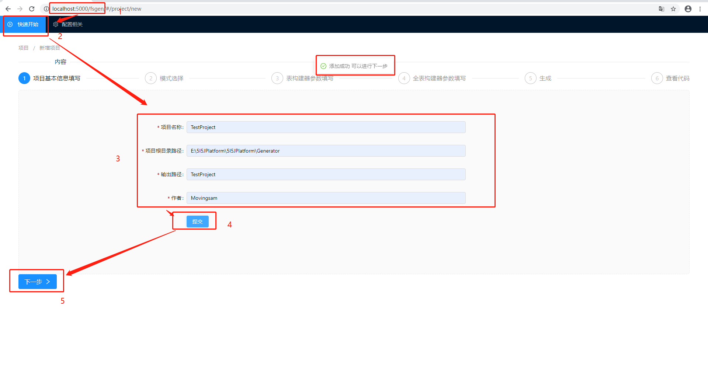
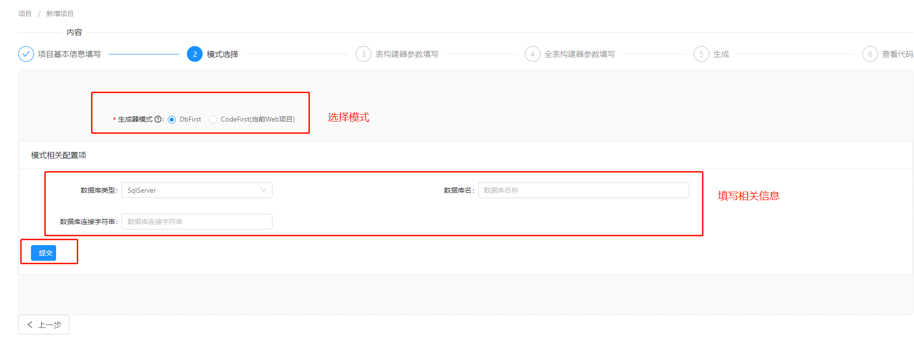

# FreeSqlBuilder (未完成)
---
#### 一款以FreeSql为基础的代码生成器中间件
---
### 相关组件：
- FreeSqlBuilder 
- FreeSqlBuilder.Core
- FreeSqlBuilder.TemplateEngine
- FreeSqlBuilderUI
---
### 用法:
> 添加Nuget引用
```
dotnet add package FreeSqlBuilder
dotnet add package FreeSqlBuilderUI
dotnet add package FreeSql.Provider.Sqlite  #这是FreeSql数据库驱动 自行切换
```


> ConfigureServices添加相关服务

``` CSharp
public void ConfigureServices(IServiceCollection services)
{
    //有两个配置项可以更改
    //DefaultTemplatePath 默认值 "RazorTemplate"
    //代表着会从当前项目路径中的RazorTemplate文件夹下读取模板
    //初始化会把默认模板（模板范例）复制到此文件夹下
    //DBSET 默认Sqlite 默认值 "Data Source=fsbuilder.db;Version=3"
    //代表着持久化数据的连接字符串
    services.AddFreeSqlBuilder();//默认 

    services.AddFreeSqlBuilder(opt =>
    {
        opt.DbSet.DbType = DataType.SqlServer;
        opt.DbSet.ConnectionString = "Data Source=.;Initial Catalog=fsbuilder;User Id=sa;Password=dbpasword;";
    });;//自定义范例
}
！！！ 需要注意随着使用的数据库不同需要自行加载相关FreeSqlProvider Nuget包 包括默认的Sqlite
```


> Configure添加中间件

``` CSharp
public void Configure(IApplicationBuilder app, IWebHostEnvironment env)
{
    
    //Path代表网站运行后 使用这个地址作为访问地址 比如网站地址为http://localhost:5000/
    //那么中间件的访问地址则为http://localhost:5000/FsGen;
    app.UseFreeSqlBuilderUI();//默认 Path = "FsGen"
    //下面这个是自定义选项
    app.UseFreeSqlBuilderUI(opt =>
    {
        opt.Path = "Gen";//可以自行修改url
    });
}

```

### 操作指南
> Step1


> Step2 - DbFirst
 
CodeFirst


